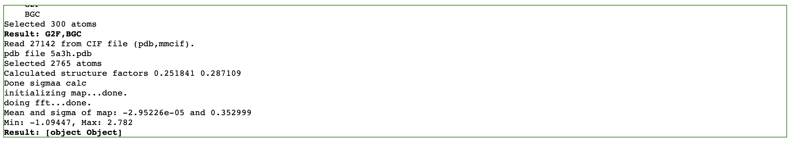
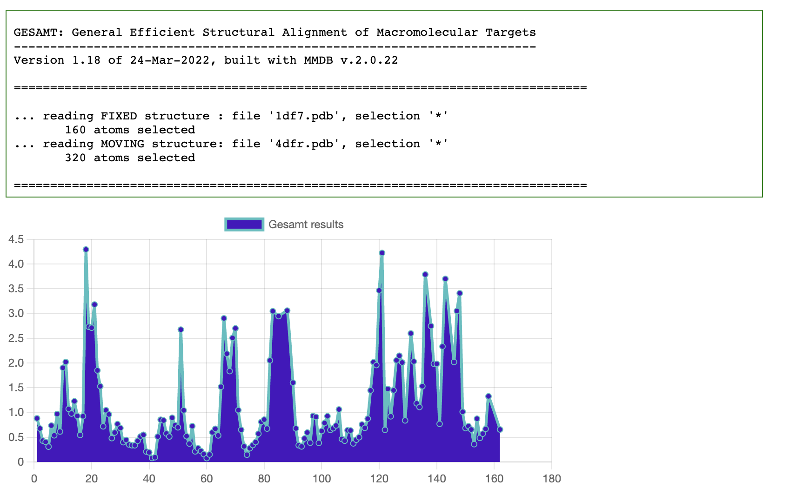
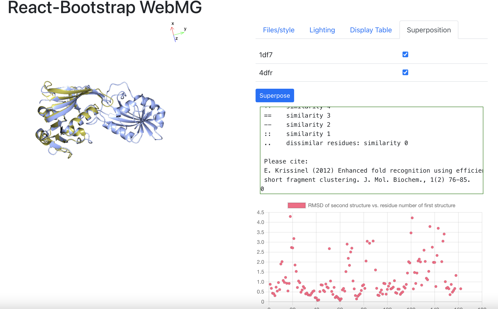

# CCP4/Coot/Privateer Web Assembly

This project is a set of scripts, patches and CMakeLists.txt files
which enable the compilation of  some of the [CCP4](https://www.ccp4.ac.uk/) libraries and programs, some of [Coot](https://www2.mrc-lmb.cam.ac.uk/personal/pemsley/coot/), [FFTW2](https://www.fftw.org/), [Privateer](https://github.com/glycojones/privateer) and the [Gnu Scientific Library](https://www.gnu.org/software/gsl/) to Web Assembly. 

Contained are some examples of using the generated JS/Web Assembly:

* A command line example which offers some of the functionality of the CCP4 program `superpose`.
* A command line example which offers some of the functionality of the CCP4 program `gesamt`.
* A command line example which does a structure factor calculation with `clipper`.
* A web server example which does superposition, structure factor calculations, map calculations, 2D ligand viewing with
[RDKit](https://github.com/rdkit/rdkit/tree/master/Code/MinimalLib) and glycosolation tree visualisation with privateer.
* A React-Bootstrap web server example which does superposition and shows results in 3D.

The emscripten suite of tools is required to do the
compilation.

The sources of CCP4, Coot, Privateer, FFTW, and GSL are not included. They are downloaded and (possibly) patched by the running
the `get_sources` script, which is part of the build process of this project.

The following libraries/programs are compiled to Web Assembly:
* libccp4 (bzr)
* clipper (bzr)
* ssm (bzr)
* mmdb2 (bzr)
* ccp4srs (bzr)
* rvapi (bzr)
* gesamt (bzr)
* ccp4mg (partial - normal modes and dependencies) (bzr)
* privateer MKIV
* Coot 0.9.6
* fftw 2.1.5
* gsl 2.7.1

Additionally [gemmi](https://github.com/project-gemmi/gemmi) is downloaded as it is a compile-time dependency of privateer. gemmi is
not itself compiled by this project.

## **Compilation instructions**

**Requirements** 

* A Bourne-like shell
* bzr
* git
* curl
* patch
* emsdk (Steps 1 and 2 below)
* cmake
* A *native* C++ compiler. (This is required for part of the `boost` build system).
* `autoconf`,`autotools`
* `libtool`

1. Install emscripten (following  [https://emscripten.org/docs/getting_started/downloads.html](https://emscripten.org/docs/getting_started/downloads.html)):  
`git clone https://github.com/emscripten-core/emsdk.git`  
`cd emsdk`  
`git pull`  
`./emsdk install latest`  
`./emsdk activate latest`

2. Each time you want to use emscripten:  
`source ./emsdk_env.sh`

3. Get the sources:  
`git clone https://github.com/stuartjamesmcnicholas/CCP4-Web-Assembly.git ccp4_wasm`  
`cd ccp4_wasm`  
`./get_sources`

4. Build gsl, Coot, the CCP4 libraries and examples:  
`emcmake cmake .`  
`emmake make`

5. Run the command line examples:  
`cd example`  
`node ccp4_example.js`  
`node superpose.js 4dfr.pdb 8dfr.pdb`  
`cd ../privateer`  
`node privateer.js -pdbin 5fjj.pdb -cores 1`  
`cd ../coot`  
`node fix-nomenclature.js ../example/4dfr.pdb out.pdb`  
`cd ../gesamt`  
`node gesamt.js ../example/4dfr.pdb ../example/8dfr.pdb`  

6. To run the web example, put the contents of the `web_example` directory on a web server.  
This can be a full-scale web server, or a simple one, e.g:  
`cd web_example`  
`python3 -m http.server 7800 &`  
And then point a web browser at `http://localhost:7800/test.html` .  
In either case you will have to set `ligandServer` in `pdb_worker.js` to point to the CCP4 monomer library. One way to do this is to leave it as `"/monomers/"` and create a symbolic link to a local CCP4 monomer library, e.g. (in `web_example`):  
`ln -s /Applications/ccp4-8.0/lib/data/monomers`

7. To run an example using React-Bootstrap:  
`make install` (This copies some files from `web_example` to `react-app/public/wasm`  
`cd react-app`  
`npm start`  
And then point a web browser at `http://localhost:3000/` .  
Again you will need to set up `ligandServer` as in the non-react example (in `react-app/public`):  
`ln -s /Applications/ccp4-8.0/lib/data/monomers`  
This example demonstrates CCP4 web assembly only by the use of `RDKit` to make ligand pictures; it further demonstrates React-Bootstrap and WebGL.

8. To run a suite of javascript tests:  
For reason of file searching, you will have to make a symbolic link to allow jest (the javascript testing framework) to find the data associated with the mini-rsr-web javascript file which defines the coot interface.  You will then need to install jest, but subsequently testing should be straightforward.  
`cd tests`  
`ln -s ../coot/mini-rsr-web.data`  
`npm install`  
`npm test`  
When testing is completed, you will have to issue a `<ctrl-C>`.  

7. To run an example using Martin's clean slate baby-gru application:  
`make install` (This copies some files from `web_example` to `baby-gru/public/wasm`  
`cd baby-gru`  
`npm install`  
`npm start`  
And then point a web browser at `http://localhost:3000/` .  
Again you will need to set up `ligandServer` as in the non-react example (in `baby-gru/public`):  
`ln -s $CCP4/lib/data/monomers`  

*Ligands pictures produced by interrogating file with MMDB2 and rendering with RDKit. Glycosylation trees produced by privateer.*

*Text output trapped from printf/cout and displayed asynchronously in browser div element.*

*Chart.js plot of gesamt alignment distances.*

*Chart.js and WebGL 3D view of gesamt superposition*

## **What else can do with the compiled libraries?**

See `example/example.cc` or `checkout/privateer-MKIV/src/privateer.cpp` to see how to create a command line (node) program. The
latter is quite long and a patched version of the original privateer code. It might be more helpful to look at the patch file
`patches/privateer-emscripten.patch`. This should show how to patch an existing command line program which reads files to one
that will work within node.

See `web_example/web_example.cc` to see use of `EMSCRIPTEN_BINDINGS` to expose a couple of Clipper classes
and Privateer, GSL and custom methods to the web browser. In due course, more Clipper classes may be added to this and thus
be made available to JavaScript in the browser.

Studying the way `mmd2_example` is defined and exported in `web_example/web_example.cc` and
then used in `web_example/pdb_worker.js` should help with understanding how to use C++ classes which read files in browser Worker Threads.

Any program you write, which uses the *subset* of Coot, Clipper, Privateer code which this project compiles to WASM, can
itself be compiled to WASM and used within node or Web Browser. Studying the examples should show you to do I/O, which is
different in the 2 cases. If you require more classes or methods from the libraries to be exposed to JavaScript, then changes need to be made to
`web_example/web_example.cc`. This should only be necessary for browser usage - in node your whole program can be written in C++.

## **References**

* Emscripten
    *   [https://emscripten.org/](https://emscripten.org/)
    *   [Emscripten: An LLVM-to-JavaScript Compiler](https://github.com/emscripten-core/emscripten/blob/main/docs/paper.pdf)
* Coot
    * P. Emsley; B. Lohkamp; W.G. Scott; Cowtan (2010). *Features and Development of Coot*, Acta Crystallographica. **D66 (4)** p486–501.
* Privateer
    * Agirre, J., Iglesias-Fernández, J., Rovira, C., Davies, G.J., Wilson, K.S. and Cowtan, K.D., (2015), *Privateer: software for the conformational validation of carbohydrate structures*, Nature Structural and Molecular Biology **22(11)**, p.833.
    * Bagdonas, H., Ungar, D. and Agirre, J., (2020), *Leveraging glycomics data in glycoprotein 3D structure validation with Privateer*, Beilstein Journal of Organic Chemistry, **16(1)**, p2523-2533.
* Clipper
    * Cowtan K (2003), *The Clipper C++ libraries for X‐ray crystallography*, IUCr Comput Comm Newslett **2**, p4–9
* CCP4
    * Winn MD, Ballard CC, Cowtan KD, Dodson EJ, Emsley P, Evans PR, Keegan RM, Krissinel EB, Leslie AGW, McCoy A, McNicholas SJ, Murshudov GN, Pannu NS, Potterton EA, Powell HR, Read RJ, Vagin A, Wilson KS (2011), *Overview of the CCP4 suite and current developments*, Acta Cryst **D67**, p235–242. 
* Gemmi
    *   [https://github.com/project-gemmi/gemmi](https://github.com/project-gemmi/gemmi)
* Gesamt
    *   Krissinel E. (2012), *Enhanced fold recognition using efficient short fragment clustering*, Journal of molecular biochemistry, **1(2)**, p76–85.
* ProSMART
    * R.A. Nicholls, M. Fischer, S. McNicholas and G.N. Murshudov (2014) *Conformation-Independent Structural Comparison of Macromolecules with ProSMART.* Acta Cryst. **D70**, p2487-2499.
* GSL
    * M. Galassi et al, GNU Scientific Library Reference Manual (3rd Ed.), ISBN 0954612078
    * https://www.gnu.org/software/gsl/
* FFTW
    *   Frigo, Matteo and Johnson, Steven G. (2005), *The Design and Implementation of FFTW3*, Proceedings of the IEEE **93(2)**, p216-231.
* RDKit
    *  RDKit for JavaScript (Official) [https://github.com/rdkit/rdkit/tree/master/Code/MinimalLib](https://github.com/rdkit/rdkit/tree/master/Code/MinimalLib)
    *  RDKit: Open-source cheminformatics [https://www.rdkit.org](https://www.rdkit.org)
