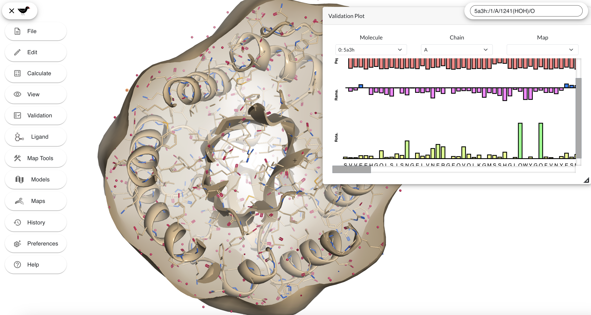

# Moorhen

Moorhen is a web browser molecular graphics program based on the Coot desktop program.
It is developed by porting some [CCP4](https://www.ccp4.ac.uk/) libraries and programs, [Coot](https://www2.mrc-lmb.cam.ac.uk/personal/pemsley/coot/), [FFTW2](https://www.fftw.org/), [Privateer](https://github.com/glycojones/privateer) and the [Gnu Scientific Library](https://www.gnu.org/software/gsl/) to Web Assembly.

The emscripten suite of tools is required to do the
compilation.

The sources of CCP4, Coot, Privateer, FFTW, and GSL are not included. They are downloaded and (possibly) patched by the running
the `get_sources` script, which is part of the build process of this project.

The following libraries/programs are compiled to Web Assembly:
* libccp4 (8.0.0)
* clipper (20240123)
* ssm (1.4.0)
* mmdb2 (2.0.22)
* gemmi 0.6.4
* Coot 1.0 ('gtk3' git branch)
* fftw 2.1.5
* gsl 2.7.1
* Boost 1.83.0
* glm 0.9.9.8
* RDKit 2023_09_1

Moorhen is available to use at [https://moorhen.org](https://moorhen.org).

Further information can be found in our [wiki pages](https://moorhen-coot.github.io/wiki/) and our [dev. docs](https://moorhen-coot.github.io/Moorhen/).

## **Binaries**

Binaries are available on the releases page. Please read the instructions there before using.

## **Compilation instructions**

**Requirements** 

* A Bourne-like shell
* git
* curl
* patch
* ninja
* meson
* cmake
* A *native* C++ compiler. (This is required for part of the `boost` build system).
* `autoconf`,`autotools`
* `libtool`
* emsdk (Steps 1 and 2 below)

Most of these can be installed by somelike like `sudo apt install list git cmake curl patch meson ninja-build autoconf autotools libtool g++` on a Debian like system.

1. Install emscripten (following  [https://emscripten.org/docs/getting_started/downloads.html](https://emscripten.org/docs/getting_started/downloads.html)):  
`git clone https://github.com/emscripten-core/emsdk.git`  
`cd emsdk`  
`git pull`  
`./emsdk install latest`  
`./emsdk activate latest`

2. Each time you want to use emscripten:  
`source ./emsdk_env.sh`

3. Get the sources:  
`git clone https://github.com/moorhen-coot/Moorhen.git`  
`cd Moorhen`  
`./get_sources`

5. Build gsl, Boost, RDKIt, Coot, the CCP4 libraries and examples:  
 In this branch, it is intended that you do the build in the source directory. 
 After first checkout you should run the following script to build:  
`./moorhen_build.sh`  
This should build all dependencies and then `Moorhen`. 
\
\
It is also possible to build a 64-bit version of Moorhen which (currently) can address up to 8GB memory:  
`./moorhen_build.sh --64bit`  
Note that you need a 64-bit WASM capable web browser to use this. Most browsers are not 64-bit capable by default. Some have
64-bit capability available as an option or in development versions.  
See the `MEMORY64` feature at [https://webassembly.org/features/](https://webassembly.org/features/)  
Moorhen developers have seen success with Firefox Nightly on MacOS and Linux and Chrome Canary (with `chrome://flags/#enable-experimental-webassembly-features`) on MacOS.

6. To run the Moorhen molecular graphics application:  
`cd baby-gru`  
`npm start`  
And then point a web browser at `http://localhost:5173/` .  

## **Updating**

1. When you wish to update the application from this git repository and the `Coot` git repository, do the following steps:  
    1. `git pull`
    2. `cd checkout/coot-1.0`
    3. `git pull`
    4. `cd ../..`
    5. `cd CCP4_WASM_BUILD/moorhen_build`
    6. `make install` (or e.g. `make -j8 install` to build on 8 processors).

*The Moorhen WebGL application*

## **What else can do with the compiled libraries?**

See `coot/moorhen-wrappers.cc` to see use of `EMSCRIPTEN_BINDINGS` to expose Coot methods to the web browser.

Any program you write, which uses the *subset* of Coot, Clipper, code which this project compiles to WASM, can
itself be compiled to WASM and used within node or Web Browser. Studying the examples should show you to do I/O, which is
different in the 2 cases. If you require more classes or methods from the libraries to be exposed to JavaScript, then changes need to be made to
`coot/moorhen-wrappers.cc`. This should only be necessary for browser usage - in node your whole program can be written in C++.

## **References**

* Emscripten
    *   [https://emscripten.org/](https://emscripten.org/)
    *   [Emscripten: An LLVM-to-JavaScript Compiler](https://github.com/emscripten-core/emscripten/blob/main/docs/paper.pdf)
* Coot
    * P. Emsley; B. Lohkamp; W.G. Scott; Cowtan (2010). *Features and Development of Coot*, Acta Crystallographica. **D66 (4)** p486–501.
* Privateer
    * Agirre, J., Iglesias-Fernández, J., Rovira, C., Davies, G.J., Wilson, K.S. and Cowtan, K.D., (2015), *Privateer: software for the conformational validation of carbohydrate structures*, Nature Structural and Molecular Biology **22(11)**, p.833.
    * Bagdonas, H., Ungar, D. and Agirre, J., (2020), *Leveraging glycomics data in glycoprotein 3D structure validation with Privateer*, Beilstein Journal of Organic Chemistry, **16(1)**, p2523-2533.
* Clipper
    * Cowtan K (2003), *The Clipper C++ libraries for X‐ray crystallography*, IUCr Comput Comm Newslett **2**, p4–9
* CCP4
    * Winn MD, Ballard CC, Cowtan KD, Dodson EJ, Emsley P, Evans PR, Keegan RM, Krissinel EB, Leslie AGW, McCoy A, McNicholas SJ, Murshudov GN, Pannu NS, Potterton EA, Powell HR, Read RJ, Vagin A, Wilson KS (2011), *Overview of the CCP4 suite and current developments*, Acta Cryst **D67**, p235–242. 
* Gemmi
    *   [https://github.com/project-gemmi/gemmi](https://github.com/project-gemmi/gemmi)
* Gesamt
    *   Krissinel E. (2012), *Enhanced fold recognition using efficient short fragment clustering*, Journal of molecular biochemistry, **1(2)**, p76–85.
* ProSMART
    * R.A. Nicholls, M. Fischer, S. McNicholas and G.N. Murshudov (2014) *Conformation-Independent Structural Comparison of Macromolecules with ProSMART.* Acta Cryst. **D70**, p2487-2499.
* GSL
    * M. Galassi et al, GNU Scientific Library Reference Manual (3rd Ed.), ISBN 0954612078
    * https://www.gnu.org/software/gsl/
* FFTW
    *   Frigo, Matteo and Johnson, Steven G. (2005), *The Design and Implementation of FFTW3*, Proceedings of the IEEE **93(2)**, p216-231.
* RDKit
    *  RDKit: Open-source cheminformatics [https://www.rdkit.org](https://www.rdkit.org)
* Boost
    * Boost C++ libraries [https://www.boost.org/users/license.html](https://www.boost.org/users/license.html)
* GLM
    * Open GL Mathematics [https://github.com/g-truc/glm](https://github.com/g-truc/glm)

